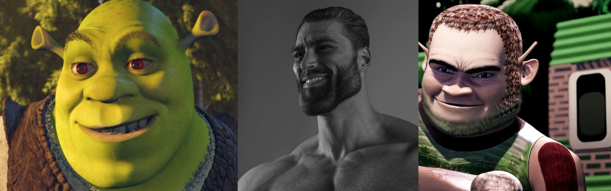

# Remix
Image Style Transfer a.k.a Midjourney Remix

## Usage

Each approach has its own README with inference instructions and how it works section.

## Results

### Aproach 1: Stable diffusion image-guided remix

Gigachad to Shrek

Shrek to Gigachad

Boromir to Wasowski

Wasowski to Boromir

### Aproach 2: Stable diffusion text-guided remix

Gigachad to Shrek

Shrek to Gigachad

Boromir to Wasowski

Wasowski to Boromir

### Aproach 3: Stable diffusion image variations - image mixup

Gigachad to Shrek

Shrek to Gigachad

Boromir to Wasowski

Wasowski to Boromir

